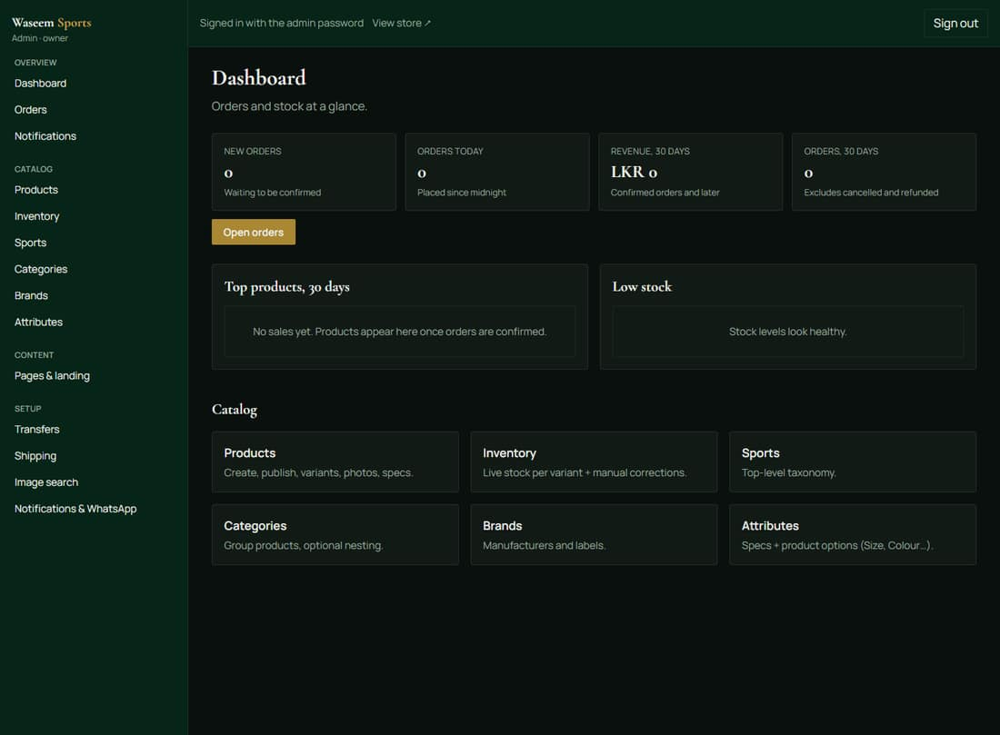
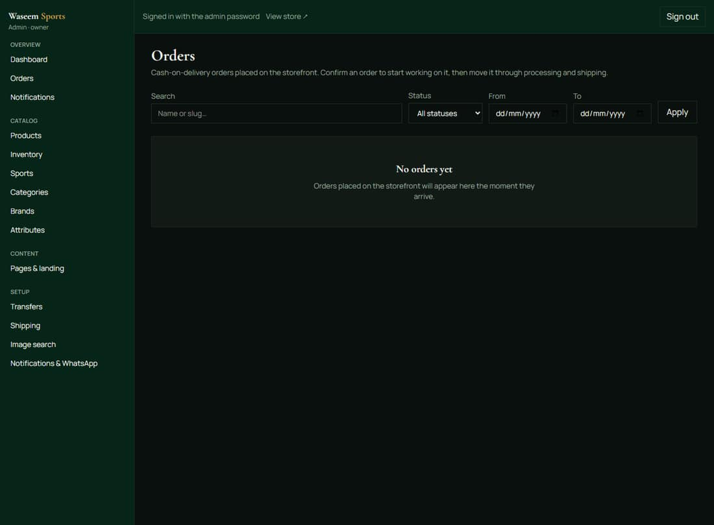
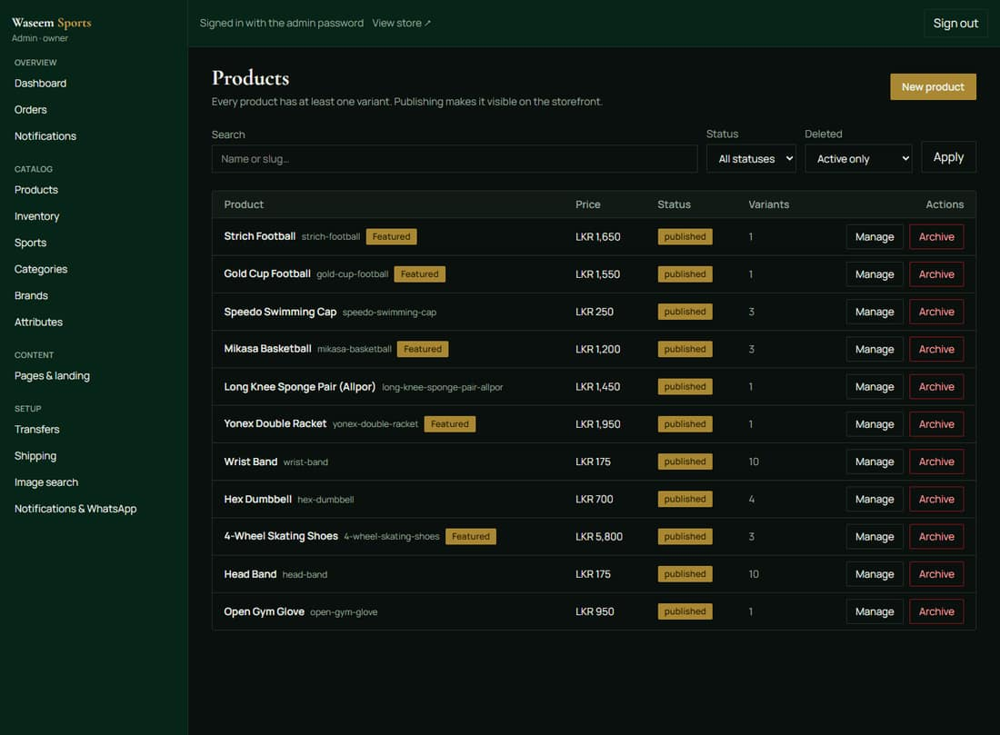
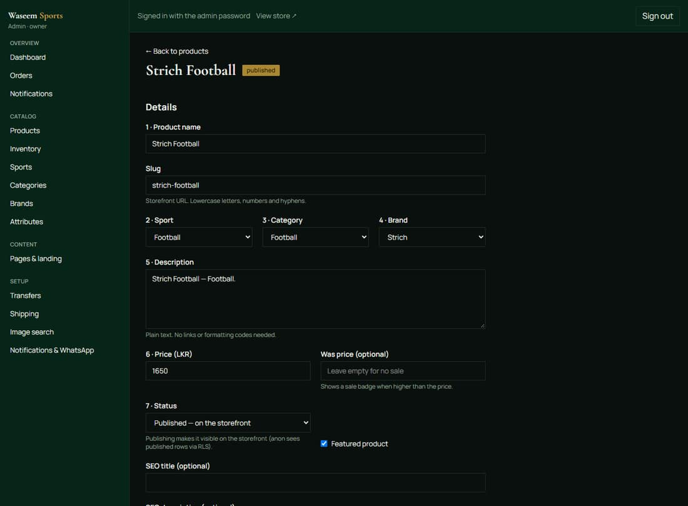
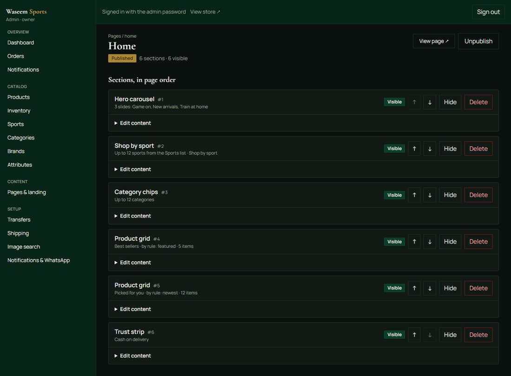
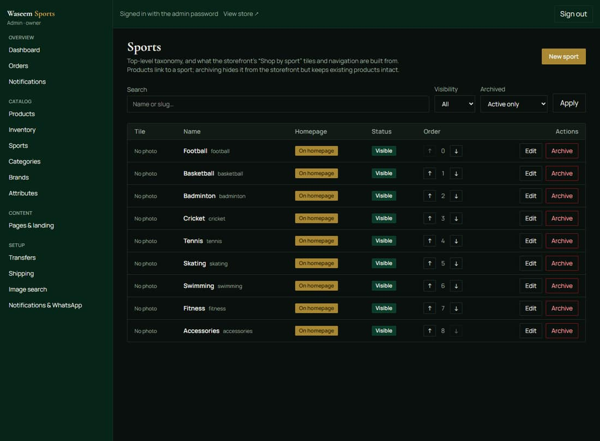
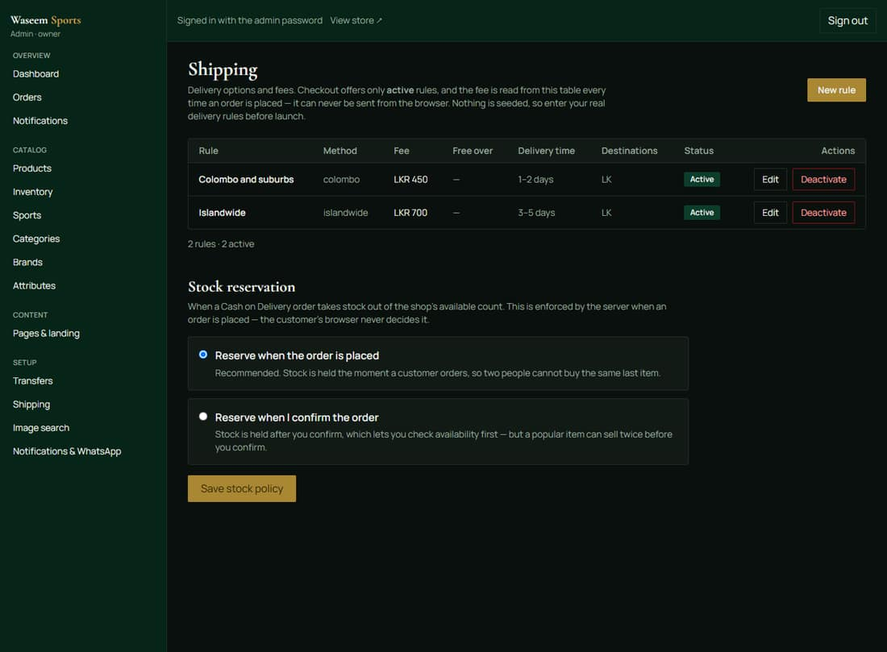

# Waseem Sports — owner's quick guide

One page for the screens you will actually use. Everything is in the admin area at
**`https://<your-domain>/admin`** (the storefront never shows a link to it).

> Screenshots below are from the build on 2026-10-08. If a label ever looks
> different, the screen is the same one — the buttons are named in full.

---

## 1. Getting in

Open `/admin`. One password field: the password we set up for you. If it asks for an
email and password instead, the shared password has been turned off and you have a
personal account (ask for a reset link if you have forgotten it).

*The dashboard — what needs your attention today, and this week's numbers.*

---

## 2. Orders — the daily loop

**Orders** lists everything with a status. Open an order to see the customer, the
items, the money, and the buttons that move it along:

**New → Confirmed → Processing → Shipped → Delivered**

- **Confirm** a COD order once you have spoken to the customer.
- **Shipped** is when it leaves the shop ("Delivered" is when it arrives).
- **Cancel** returns the reserved stock to the shelf by itself.
- The **stock panel** on the order is the escape hatch: Reserve / Commit / Release,
  for the times you fix something by hand.
- **Notes** are internal — the customer never sees them.

---

## 3. Products, prices and stock

**Products** is the catalogue. Search it, open a product, and you get the name,
price, variants (sizes/colours), specs and photos.

- **Price** — either on the product (the default) or per variant.
- **Stock** — **Inventory** shows every variant's on-hand and reserved. If a variant
  should never run out (a service item), untick *track inventory*.
- **Photos** — upload from the product page; the shop re-sizes and stores them for
  you. "Find recommended images" suggests manufacturer images you can approve.
- **New product** — the button at the top of the Products list.

*Per-product: details, variants, specs, and photos.*

---

## 4. The homepage (and any other page)

**Pages → Home** is the landing page, built from blocks you control:

- **Add** a block (hero banner, Shop by sport, category chips, product grid, trust
  strip, countdown deal, text).
- **Move** a block up/down, **hide** it without deleting it, **edit** its text.
- **Publish** — until you press it, customers see the previous version. *View page ↗*
  opens what they see.

**Shop by sport** is driven by **Sports**: each sport has a photo, an order, and a
"show on the homepage" switch. Reorder the tiles with the one-step arrows.

---

## 5. Delivery charges — please set these

**Shipping** is where the delivery fees and timeframes live. The FAQ page and
checkout both read whatever is in here — the numbers in the shop today are placeholders
from set-up, not your prices. Enter the real ones (e.g. Colombo Rs 450 / 1–2 days,
islandwide Rs 700 / 3–5 days) or archive the rules and take orders over the phone.

---

## 6. What is switched off (on purpose)

Nothing is pretending to work:

- **WhatsApp / SMS / email order updates** — no provider is connected yet. Orders
  record that a message was *skipped*; nothing is sent, and no order is ever affected.
  The status panel is under **Notifications & WhatsApp**.
- **Card payments and bank transfers** — cash on delivery only. The transfers screen is
  where a bank integration would appear.
- **Find recommended images** — needs an image-search key; manual upload works fully.

---

## 7. If something looks wrong

| What you see | What to do |
|---|---|
| Online ordering says it isn't open | add your delivery rule in **Shipping** |
| A cart line says out of stock | put stock back in **Inventory** for that variant |
| A customer says their link doesn't open | re-send the tracking link from the order page |
| You are locked out of the password screen | wait 15 minutes (the shop blocks repeated wrong passwords), then try again |
| Anything else | note the screen and the time; whoever runs the site has a runbook for it (`docs/RUNBOOK.md`) |
